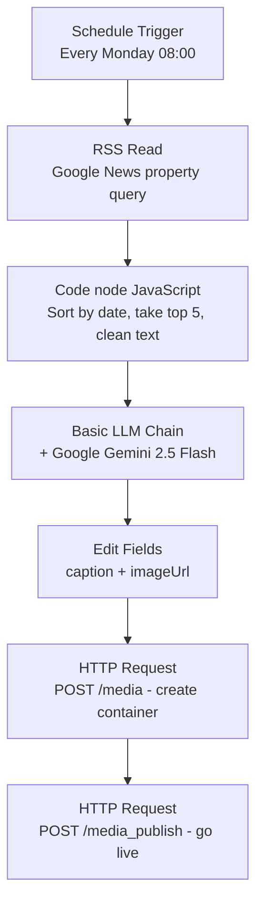

# Weekly IG Post Generator — 99 Group AI Assessment

Auto-generate Instagram posts from the latest property news, built end-to-end in n8n.

## Live Result

- Published post: https://www.instagram.com/p/DbOGhQfGT93/
- Workflow status: Published/active in n8n, scheduled to run every Monday at 08:00

## Architecture



## Why this stack

- **RSS over a paid news API**: Google News RSS needs no API key, updates in real time, and n8n has a built-in RSS Read node.
- **A Code node instead of chained Sort/Limit/Aggregate nodes**: sorting by real publish date, deduplicating title vs. source, and building one combined text block was clearer as a few lines of JavaScript than three separate built-in nodes.
- **Google Gemini 2.5 Flash instead of a paid model**: free tier with a generous daily quota, more than enough for one generation per week.
- **Two raw HTTP Request nodes instead of a dedicated Instagram node**: n8n has no first-party Instagram publishing node, so the two-step Instagram Graph API flow (create media container, then publish) is called directly.

## AI usage

AI is used at a single, isolated step: turning the week's filtered news into one ready-to-publish Instagram caption. Fetching, sorting, and cleaning are all deterministic code, not AI, so that part of the pipeline stays consistent and auditable. The model only sees already-structured data and is responsible purely for writing the caption copy.

**Model:** Google Gemini 2.5 Flash, via n8n's native Google Gemini Chat Model node, attached to a Basic LLM Chain node.

**Prompt (Basic LLM Chain):**

```
Kamu adalah admin media sosial 99 Group, perusahaan properti. Berdasarkan lima berita properti minggu ini di bawah, buat satu caption Instagram dalam Bahasa Indonesia dengan struktur berikut: satu kalimat hook pembuka yang menarik perhatian, 2-3 kalimat insight yang merangkum tren dari berita-berita ini, satu kalimat call-to-action singkat, dan 5-8 hashtag properti Indonesia yang relevan. Tulis dengan gaya profesional tapi ramah, maksimal 150 kata.

Berita minggu ini:
{{ $json.combinedText }}
```

`{{ $json.combinedText }}` is an n8n expression that injects that week's top 5 cleaned articles at run time, so the caption changes every week based on current news.

## Pipeline steps in detail

1. **Schedule Trigger** — fires every Monday at 08:00.
2. **RSS Read** — pulls the latest items from a Google News RSS query filtered for Indonesian property news.
3. **Code (JavaScript)** — sorts all items by actual publish date (RSS order isn't chronological), keeps the top 5, splits each title into headline + source, and joins everything into one text block.
4. **Basic LLM Chain + Gemini** — generates the caption from that text block using the prompt above.
5. **Edit Fields (Set)** — assembles the final `caption` and `imageUrl` fields the publish step needs.
6. **HTTP Request (create container)** — `POST /{ig-user-id}/media` with `image_url`, `caption`, and `access_token`.
7. **HTTP Request (publish)** — `POST /{ig-user-id}/media_publish` with the returned `creation_id`, which puts the post live.

## Repo contents

- `workflow.json` — full n8n workflow export (credentials/tokens removed — replace `YOUR_ACCESS_TOKEN_HERE` with your own Instagram access token before importing)
- `template-post-properti.jpg` — the branded template image used as the post's visual
